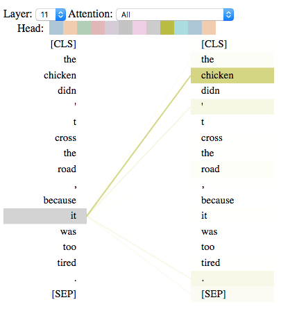

<!-- README.md is generated from README.Rmd. Please edit that file -->

<!-- badges: start -->

[](https://www.tidyverse.org/lifecycle/#maturing)
[](https://travis-ci.org/jonathanbratt/RBERTviz)
[](https://ci.appveyor.com/project/jonathanbratt/RBERTviz)
[](https://codecov.io/gh/jonathanbratt/RBERTviz?branch=master)
<!-- badges: end -->

RBERTviz provides tools for convenient visualization of BERT models in
the RBERT package.

## Installation

You can install RBERTviz from [GitHub](https://github.com/) with:

``` r
# install.packages("devtools")
devtools::install_github(
  "jonathanbratt/RBERTviz", 
  build_vignettes = TRUE
)
```

### RBERT Installation

RBERTviz is intended to be used alongside the RBERT package. See the
installation instructions in that
[repository](https://github.com/jonathanbratt/RBERT).

## Basic usage

RBERTviz currently enables visualization of

1.  the attention matrices for each attention head
2.  the output vectors at each transformer layer

The attention visualizer is basically a wrapper around an earlier
version of the [transformer visualization
tools](https://github.com/tensorflow/tensor2tensor/tree/master/tensor2tensor/visualization),
as adapted by [Jesse Vig](https://github.com/jessevig/bertviz/).

 

The output vector visualizer is a collection of routines for generating
2D PCA plots of the layer outputs, which can be interpreted as
context-dependent embedding vectors.


See the “Introduction to RBERTviz” vignette included with the package
for more detailed examples of usage.

## Disclaimer

This is not an officially supported Macmillan Learning product.

## Contact information

Questions or comments should be directed to Jonathan Bratt
(<jonathan.bratt@macmillan.com>) and Jon Harmon
(<jon.harmon@macmillan.com>).
