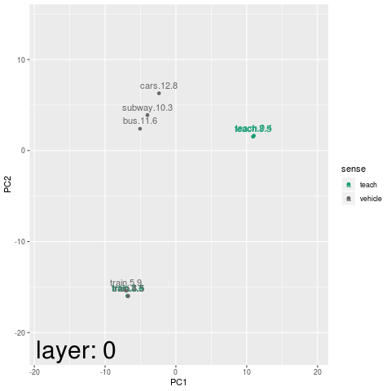

<!-- 
Copyright 2019 Bedford Freeman & Worth Pub Grp LLC DBA Macmillan Learning.

Licensed under the Apache License, Version 2.0 (the "License");
you may not use this file except in compliance with the License.
You may obtain a copy of the License at

    http://www.apache.org/licenses/LICENSE-2.0

Unless required by applicable law or agreed to in writing, software
distributed under the License is distributed on an "AS IS" BASIS,
WITHOUT WARRANTIES OR CONDITIONS OF ANY KIND, either express or implied.
See the License for the specific language governing permissions and
limitations under the License.
-->


```{r, include = FALSE}
knitr::opts_chunk$set(
  collapse = TRUE,
  comment = "#>"
)
```

`RBERTviz` is intended to accompany the `RBERT` package. It contains functions
for visualizing the output and structure of BERT models from within `R`.


# Attention Visualizer

Much of this part of the package is simply a wrapper around the fantastic
[visualization tools](https://github.com/jessevig/bertviz/) developed by Jesse
Vig.


```{r eval=FALSE}
library(RBERTviz)

# Download pre-trained BERT model.
BERT_PRETRAINED_DIR <- RBERT::download_BERT_checkpoint(
  model = "bert_base_uncased"
)

vocab_file <- file.path(BERT_PRETRAINED_DIR, "vocab.txt")
init_checkpoint <- file.path(BERT_PRETRAINED_DIR, "bert_model.ckpt")
bert_config_file <- file.path(BERT_PRETRAINED_DIR, "bert_config.json")

chicken <- c("The chicken didn't cross the road, because it was too tired.",
             "The chicken didn't cross the road, because it was too wide.")
chicken_ex <- RBERT::make_examples_simple(chicken)

feats_chicken <- RBERT::extract_features(examples = chicken_ex,
                                         vocab_file = vocab_file,
                                         bert_config_file = bert_config_file,
                                         init_checkpoint = init_checkpoint,
                                         layer_indexes = 0:12,
                                         batch_size = 2L,
                                         features = c("output",
                                                      "attention"))
visualize_attention(feats_chicken$attention, sequence_index = 1)
```

Running the above commands will produce an interactive display in the "Viewer"
tab in RStudio. The display is a graphical representation of the self-attention
matrix for the first example sentence. BERT contains multiple layers of
attention (selected by the dropdown), with multiple heads per layer
(corresponding to the colored boxes). Focus on a single head by double-clicking
the corresponding box. The lines represent the "attention" paid *by* the tokens
on the left, *to* the tokens on the right. Heavier lines indicate larger
weights. To focus on the attention paid by or to a particular token, hover over
the token.


Different attention heads capture different aspects of language. A particularly
interesting example can be found in layer 10 of the BERT base (uncased) model,
at the 9th head (4th box from the right). Consider the attention paid by the
pronoun "it" in the first sentence above. Because "it" is tired, we easily
understand that "it" refers to the chicken, not the road. This association is
correctly reflected in the attention weights.

```{r, echo=FALSE}
knitr::include_graphics("attention1.png", dpi=120)
```

Now look at the same head for the second sentence, where "it" refers to the
road, not the chicken. 

```{r, eval=FALSE}
visualize_attention(feats_chicken$attention, sequence_index = 2)
```

Again, the attention weights reflect the correct antecedent for the pronoun.

```{r, echo=FALSE}
knitr::include_graphics("attention2.png", dpi=120)
```

In BERT, each example can have either one or two distinct segments
(conceptually like sentences, but a single segment may comprise multiple
sentences). Two-segment examples are used in sentence-pair classification, for
example. The attention visualizer can focus on the attention paid between
segments in an example.

```{r, eval=FALSE}
chicken2 <- list(c("The chicken didn't cross the road.", "It was too tired."),
                 c("The chicken didn't cross the road.", "It was too wide."))
chicken_ex2 <- RBERT::make_examples_simple(chicken2)

feats_chicken2 <- RBERT::extract_features(examples = chicken_ex2,
                                         vocab_file = vocab_file,
                                         bert_config_file = bert_config_file,
                                         init_checkpoint = init_checkpoint,
                                         layer_indexes = 1:12,
                                         batch_size = 2L,
                                         features = c("output",
                                                      "attention"))
visualize_attention(feats_chicken2$attention, sequence_index = 2)
```

Selecting "Sentence A -> Sentence B" from the "Attention" dropdown produces a
display showing just the attention paid *by* the tokens in the first segment
*to* tokens in the second segment, and so on. 

In this particular example, it is interesting to note that splitting up the
sequence into two segments and dropping the conjunction significantly reduces
the weight and accuracy of the attention paid to the pronoun antecedent.

```{r, echo=FALSE}
knitr::include_graphics("attention3.png", dpi=120)
```

# Embeddings Visualizer

The output vectors at each of the transformer layers in a BERT model can be
interpreted as context-senstive token embeddings. It can be instructive to
visualize these vectors for selected inputs, to see (for example) how the
embedding of a token is influenced by its context. RBERTviz provides functions
for generating such visualizations quickly and easily.


Consider the `layer_outputs` element of the `feats_chicken` object defined
above. First, get the vectors in a convenient format:

```{r, eval=FALSE}
# Create a dataframe containing the token vectors from each layer,
# as well as the vectors input to layer 1 (indicated here by layer_index = 0).
embeddings <- feats_chicken$output

# Let's look at the last (12th) layer outputs...
embeddings_l12 <- filter_layer_embeddings(embeddings, layer_indices = 12L)

# ... and keep only the embeddings for a select set of tokens:
embeddings_l12_select <- keep_tokens(embeddings_l12, 
                                     c("chicken", "road", "it"))
```

The resulting dataframe has a large number of columns, so just take a look 
at the corner:

```{r, eval=FALSE}
head(embeddings_l12_select[1:6])
```

```{r, echo=FALSE}
embed_df <- readRDS("embed_df.rds")
embed_df
```

The V1 and V2 columns are just the first two of the over 700 components of the
embedding vectors. From this glimpse, it can be seen that the vector values for
identical tokens in different contexts *may* be similar, but also may have
significant differences. A better way to visualize the embedding vectors is to
employ PCA to reduce the dimension of the vector space to two, and then make a
plot:

```{r, eval=FALSE}
# this performs PCA on the vectors, then plots them with ggplot2
display_pca(embeddings_l12_select)
```

```{r, echo=FALSE, fig.width = 6, fig.height = 3}
plot1 <- readRDS("plot1.rds")
plot1
```

The points are labeled by "`<token>.<sequence_index>.<token_index>`".
We can specify a column to use to color the points differently:

```{r, eval=FALSE}
display_pca(embeddings_l12_select, color_field = "sequence_index")
```

```{r, echo=FALSE, fig.width = 6, fig.height = 3}
plot2 <- readRDS("plot2.rds")
plot2
```

Sometimes we want to manually specify the color groupings. In this case, we
might want to color tokens (including pronouns) that refer to birds differently
from those that refer to roads.

```{r, eval=FALSE}
embeddings_l12_select <- embeddings_l12_select %>% 
    dplyr::mutate(class = c("bird", "road", "bird",
                     "bird", "road", "road"))
display_pca(embeddings_l12_select, color_field = "class")
```

```{r, echo=FALSE, fig.width = 6, fig.height = 3}
plot3 <- readRDS("plot3.rds")
plot3
```

Notice that the vectors for "chicken" are very similar in both sentences, as are
the vectors for "road". However, the vectors for "it" are significantly
different, reflecting the different antecedents in the two sentences. It is
satisfying that each pronoun vector is closest to the "correct" noun
vector in this plot.

Finally, we may sometimes wish to hide certain points on the plot (e.g. for
dramatic effect on a presentation). Removing rows from the dataframe before
running the PCA will result in a different set of basis vectors, and may change
the details of the arrangement drastically. To keep a point off the plot, while
still using it to compute the PCA, use the `hide` parameter in `display_pca()`.
(You may need to manually specify the coordinate limits, since ggplot picked
those automatically, and will truncate the range if edge points are hidden.)

```{r, eval=FALSE}
display_pca(embeddings_l12_select, color_field = "class",
            hide = c(FALSE, FALSE, TRUE,
                     FALSE, FALSE, TRUE)) +
    ggplot2::ylim(-11, 26)
```

```{r, echo=FALSE, fig.width = 6, fig.height = 3}
plot4 <- readRDS("plot4.rds")
plot4
```

Here's another example.

```{r, eval=FALSE}
# The word "train" can mean different things depending on the context.
train_seq <- c("How do you train your dragon?",
               "She should train her puppy not to bite people.",
               "We train our students to think critically.",
               "I hear the train coming around the bend.",
               "This is the last stop of the train.",
               "Why is the train stopped?",
               "Let's teach our kids good manners.",
               "I want to teach her to read.",
               "Can you teach an old dog new tricks?",
               "The subway stop is closed until the fall.",
               "He will take the bus to work in the summer.",
               "I like to watch the railway cars go by.")

# These are the words (tokens) we will focus on in this example.
target_words <- c("train", "teach", "subway", "bus", "cars")

# These are the human-assigned "senses" for each occurrence of a target word in
# the the sentences above, in order. We will use these for coloring later.
train_classes <- c("teach",
                   "teach",
                   "teach",
                   "vehicle",
                   "vehicle",
                   "vehicle",
                   "teach",
                   "teach",
                   "teach",
                   "vehicle",
                   "vehicle",
                   "vehicle")

# Run the sentences through a BERT model.
feats_train <- RBERT::extract_features(
    examples = RBERT::make_examples_simple(train_seq),
    vocab_file = vocab_file,
    bert_config_file = bert_config_file,
    init_checkpoint = init_checkpoint,
    layer_indexes = 0:12,
    batch_size = 2L)

# Extract the feature vectors from the result.
train_embeddings_df <- feats_train$output
# Display the input vectors (before any layers of BERT).
train_embeddings_df %>% 
    filter_layer_embeddings(layer_indices = 0L) %>% 
    keep_tokens(tokens = target_words) %>% 
    dplyr::mutate(sense = train_classes) %>% 
    display_pca(color_field = "sense")
```

```{r, echo=FALSE, fig.width = 6, fig.height = 3}
plot5 <- readRDS("plot5.rds")
plot5
```

The embedding vectors at the input of BERT are determined almost entirely by the
token itself. (The positional encodings have been added to the vectors, so the
vectors for identical words do vary slightly depending on the location of the
token in the sentence.) All instances of "train" have embeddings that are nearly
identical, and in particular much more similar to similar to each other than to
different words that are closer in meaning.

This changes by the time we reach the final layer output.

```{r, eval=FALSE}
# Display the vectors from the final (12th) layer output.
train_embeddings_df %>% 
    filter_layer_embeddings(layer_indices = 12L) %>% 
    keep_tokens(tokens = target_words) %>% 
    dplyr::mutate(sense = train_classes) %>% 
    display_pca(color_field = "sense")
```

```{r, echo=FALSE, fig.width = 6, fig.height = 3}
plot6 <- readRDS("plot6.rds")
plot6
```

Now the word embeddings reflect the meaning of the word as used in context.

It is easier to see the progression in each layer when using the same basis
vectors for the PCA projection across a series of plots. One quick way to do
this is to facet on `layer_index` (note that `display_pca()` preserves the
columns of the input dataframe).

```{r, eval=FALSE}
# just show a few selected layers
layers_to_show <- c(0,6,12)
n_layers <- length(layers_to_show)
pca_plot <- train_embeddings_df %>% 
    filter_layer_embeddings(layer_indices = layers_to_show, 
                            sum_fun = NULL) %>% 
    keep_tokens(tokens = target_words) %>% 
    dplyr::arrange(layer_index) %>% 
    dplyr::mutate(sense = rep(train_classes, n_layers)) %>% 
    display_pca(color_field = "sense") 

pca_plot + ggplot2::facet_grid(rows = dplyr::vars(layer_index))
```

```{r, echo=FALSE, fig.width = 6, fig.height = 7}
plot7 <- readRDS("plot7.rds")
plot7
```

To show the progression through all the layers, an animation is more
convenient. We can make one using the gganimate package.

```{r, eval=FALSE}
# show all layers
layers_to_show <- 0:12
n_layers <- length(layers_to_show)
pca_plot <- train_embeddings_df %>% 
    filter_layer_embeddings(layer_indices = layers_to_show, 
                            sum_fun = NULL) %>% 
    keep_tokens(tokens = target_words) %>% 
    dplyr::arrange(layer_index) %>% 
    dplyr::mutate(sense = rep(train_classes, n_layers)) %>% 
    display_pca(color_field = "sense") 
anim <- pca_plot + gganimate::transition_states(layer_index, 
                                                transition_length = 1, 
                                                state_length = 0, 
                                                wrap = FALSE) +
    ggplot2::theme(plot.caption = ggplot2::element_text(
        size = 30,
        hjust = 0,
        margin = ggplot2::margin(-2, 0, 1, 0, "cm")
    )) +
    ggplot2::labs(caption = " layer: {closest_state}")

fps <- 15
pause_time <- 2
time_per_layer <- 1
nframes <- n_layers*fps*time_per_layer + 2*pause_time*fps
gganimate::animate(anim, nframes = nframes, fps = fps, 
                   start_pause = pause_time*fps, 
                   end_pause = pause_time*fps) 
```



